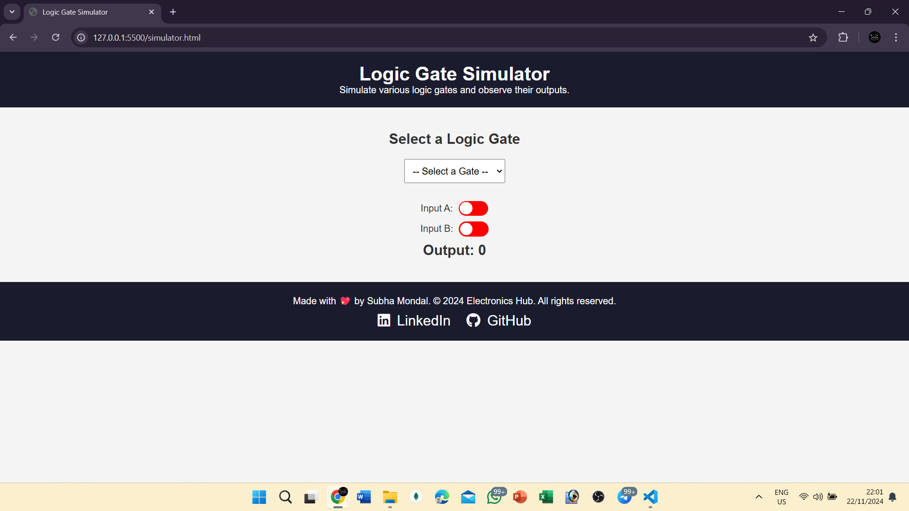

# Digital Electronics Website ⚡

Welcome to **Digital Electronics**, a comprehensive platform that helps you understand the fundamentals of digital electronics, with a special focus on basic logic gates. Whether you're a student learning electronics or just someone interested in exploring the world of digital circuits, this website offers interactive features to make learning both fun and engaging.

The above screenshot shows the one features of the website, visit now to explore more like this..😊❤️

## 🌟 Features

### 1. **Electronics Fundamentals 📘**
   - Learn the core concepts of digital electronics, including binary numbers, logic gates, and their applications.
   - This section provides theoretical insights into the components that form the foundation of all digital circuits.

### 2. **Logic Gate Simulator 🔌**
   - Experiment with logic gates like AND, OR, NOT, NAND, NOR, XOR, and XNOR.
   - You can toggle inputs and immediately see the output for each logic gate.
   - A user-friendly interface allows you to simulate different digital circuits.

### 3. **Truth Table 📊**
   - Explore the truth tables of different logic gates.
   - View the expected output for every combination of inputs for each gate.
   - The truth tables are dynamically generated to match the gate selected.

### 4. **Quiz 📝**
   - Test your knowledge with quizzes on logic gates and electronics fundamentals.
   - The quiz section is designed to help reinforce learning and track your progress.

## ⚙️ Technologies Used

- HTML
- CSS
- JavaScript

## 🤝 Contributing

Feel free to contribute! Open issues, suggest features, or send pull requests. Your input is highly appreciated!

## 📄 License

This project is licensed under the MIT License - see the [LICENSE](LICENSE) file for details.

---

✨ **Happy learning and exploring the world of Digital Electronics!** ✨
